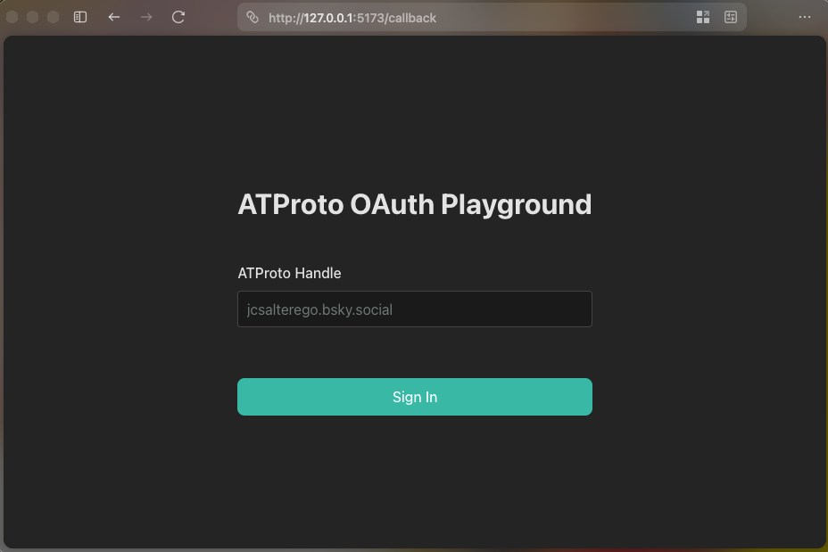
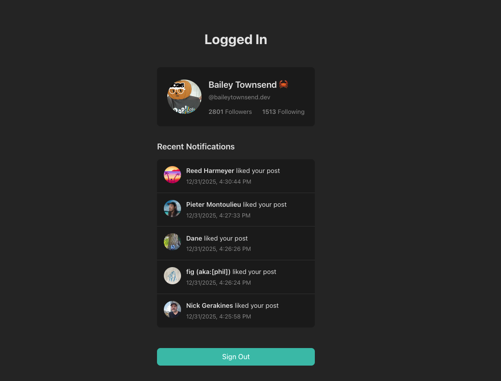

# Simple ATProto OAuth 

Simple ATProto OAuth example project using Vite and vanilla JS.

# Development
- `pnpm install` or even `npm install`
- `pnpm run dev`
- By default, the OAuth client is the local dev one. Need to make sure you access from [http://127.0.0.1:5173](http://127.0.0.1:5173) for it to work properly.
- If you want to change the oauth scopes they are at the top of [./src/main.js](./src/main.js)
- Very simple vanilla JS app show casing how to use OAuth with ATProto.
- On login sets `window.atpAgent` which is an authenticated ATProto agent to make atproto calls.

# Production/Running with a domain
If you are running this in production or with a public ascessible domain need to make a few changes.
- Set change the text `{yourdomain.com}` in [./public/oauth-client-metadata.json](./public/oauth-client-metadata.json) in `redirect_uris` and `client_id` to your domain.
- If you want to change any of the oauth scopes that's also done in [./public/oauth-client-metadata.json](./public/oauth-client-metadata.json) and loaded into the client.
- Make a copy of [.env.template](.env.template) and rename it to `.env` set the domain without https for `VITE_OAUTH_DOMAIN`
- If you're using vite to host it to test with something like ngrok/cloudflared you need to set the domain in [vite.config.js](vite.config.js) where it says `yourdomain.com`
- Make sure it's accessible from the internet. The PDS needs to call it. Also, if you keep this same design all routes need to go to the `index.html`